<!--
  README do perfil — versão FINAL (Terminal × Tokyo Night)
  Como publicar:
  1. No repo HenriqueVMonteiro/HenriqueVMonteiro, substitua o README.md por este arquivo
  2. Commit também a pasta assets/ (banner.svg e skills.svg) na raiz do repo
-->

<div align="center">
  
</div>

## `$ man henrique`

```text
HENRIQUE(1)                  Manual do Engenheiro                  HENRIQUE(1)

NOME
       henrique — engenheiro de software de baixo nível

SINOPSE
       henrique [--reverse] [--kernel] [--fullstack] <binario>

DESCRIÇÃO
       Engenharia reversa, drivers de kernel (WDK) e programação de
       sistemas. C / C++ / Assembly x86-64 — do user space ao ring 0.
       Também atua full-stack: back-end em .NET / C# e front-end em
       React + TypeScript.

CONTATO
       henriquevmont01@gmail.com

VEJA TAMBÉM
       skills(1), projetos(7), git-log(1)
```

## `$ skills --tree`

<div align="center">
  
</div>

## `$ xxd ~/projetos`

| offset | repositório | sobre | stack |
| :--- | :--- | :--- | :--- |
| `0x00` | [`Vac-Module-dumper`](https://github.com/HenriqueVMonteiro/Vac-Module-dumper) | dump de módulos do VAC com IceKey | `C++` `RE` |
| `0x01` | [`CS2-External-Fullscreen`](https://github.com/HenriqueVMonteiro/CS2-External-Fullscreen) | ferramenta externa para CS2 | `C++` |

## `$ gh stats`

<div align="center">
  
  

  <br/><br/>

  
</div>

---

<div align="center">
  
  <a href="https://github.com/HenriqueVMonteiro?tab=followers">
    
  </a>

  <br/><br/>

  <sub><code>76 6f 63 65 20 64 65 63 6f 64 69 66 69 63 6f 75 2e 20 72 65 73 70 65 69 74 6f 2e</code></sub>
</div>
